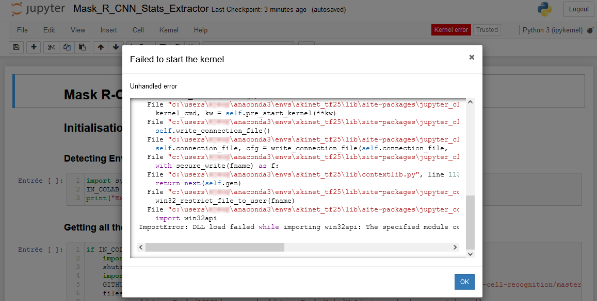

# Installation Guide

To use the available tools in this repository, you will need to install a few things first. Following is a little guide that explains how to install what is required to run the Inference Notebook, the Training Notebook or the `datasetFormator.py` script. This guide is made for Windows, you may have to check online how to install CUDA Toolkit, cuDNN and how to make a shortcut/script to start a notebook for your OS.

## Index
1. [Getting all the required tool's files](#1-getting-all-the-required-tools-files)
2. [Setting up the Python Environment](#2-setting-up-the-python-environment)
3. [Installing CUDA Toolkit and cuDNN](#3-installing-cuda-toolkit-and-cudnn)
4. [Installing TensorFlow Object Detection API](#4-installing-tensorflow-object-detection-api)
5. [Making a shortcut to easily open the tools](#5-making-a-shortcut-to-easily-open-the-tools)
6. [[Windows only] Fixing the Jupyter's kernel and win32api errors](#6-windows-only-fixing-the-jupyters-kernel-and-win32api-errors)

## 1. Getting all the required tool's files
1. [Download](../../../archive/refs/heads/stable.zip) or clone the [repository](../../../).
2. Unzip or move the repository in the directory of your choice.
3. Download the weights file(s) (a weights file is a folder containing an `assets`, `variables` folder and a `saved_model.pb` file, they might be zipped so you need to unzip it) and maybe some images you want to run the inference on and put it/them in the same folder. Images should be put in a sub-directory named `images\<Mode name>`.

## 2. Setting up the Python Environment
1. Download and install [MiniConda3](https://conda.io/en/latest/miniconda), you can also use [Anaconda3](https://www.anaconda.com/products/individual#Downloads).
2. Start **Anaconda Prompt** using **Start Menu** or **Windows Search Bar**.  
3. Using the console, move to the same directory as step 2. 
    * To change directory, use `cd <Directory Name>` command.
    * To switch the drive you are using, just write its letter adding ":" and then press ENTER (for example, to switch from C drive to D drive, write `D:` and press ENTER).  
4. Execute the following command: `conda env create -f environment.yml`.

> If you are on windows, you may want to check [§6](#6-windows-only-fixing-the-jupyters-kernel-and-win32api-errors) that describes a bug that may appear.

## 3. Installing CUDA Toolkit and cuDNN
Using a CUDA-capable GPU that supports CUDA 11.2 (please refer to [CUDA GPUs list](https://developer.nvidia.com/cuda-gpus) to know if your GPU as a `Compute Capability` of at least 3.5) will considerably accelerate training and inference.

1. Download and install [CUDA Toolkit 11.2.x](https://developer.nvidia.com/cuda-toolkit-archive).
2. Download and install [cuDNN 8.1.1 for CUDA 11.2](https://developer.nvidia.com/rdp/cudnn-archive) ([Installation Guide](https://docs.nvidia.com/deeplearning/cudnn/install-guide/index.html)).


## 4. Installing TensorFlow Object Detection API
:information_source: This step is only required if you want to train Mask R-CNN Inception ResNet V2. Training requires a recent high-end GPU with a lot of VRAM as a GTX 1080 Ti (11 GB VRAM) is already struggling training the network using ​a batch of one image.

To train Mask R-CNN Inception ResNet V2 from the TF OD API, you will need to install the OD API. To do that:

1. Clone or download and unzip the [tensorflow/models](https://github.com/tensorflow/models) repository 

2. Download [Mask R-CNN Inception ResNet V2 1024x1024](http://download.tensorflow.org/models/object_detection/tf2/20200711/mask_rcnn_inception_resnet_v2_1024x1024_coco17_gpu-8.tar.gz) from the [TF2 Detection Zoo](https://github.com/tensorflow/models/blob/master/research/object_detection/g3doc/tf2_detection_zoo.md) and unzip it next to the repository

3. Using a new anaconda environment navigate to `models/research` 

4. We need to compile Protobuf Compiler (protoc) files:
    * If you do not have protoc installed, simply execute `pip install protobuf`
    * From the terminal, use the following command: `protoc object_detection/protos/*.proto --python_out=.`

5. Then execute following commands:

    ```shell
    cp object_detection/packages/tf2/setup.py .
    python -m pip install .
    ```
    This step may cause numerous installation errors, you may want to use recommended python version according to [TF OD API README](https://github.com/tensorflow/models/blob/master/research/object_detection/README.md).

6. To test if the TF OD API has correctly been installed, execute `python object_detection/builders/model_builder_tf2_test.py` and find if tests passed or not. You should already see during this step if your GPU is being used by using Tasks Manager on Windows (`performance` > `GPU` > is the dedicated memory/VRAM used?) or using `nvidia-smi` command on another terminal (is there a python task/process using memory).

Source : [Creating your own object detector, Towards data science, Gilbert Tanner](https://towardsdatascience.com/creating-your-own-object-detector-ad69dda69c85)

## 5. Making a shortcut to easily open the tools
1. Using **Start Menu** or **Windows Search Bar**, right click on **Anaconda Prompt** and click on `Open file location`.
2. In the file explorer, right click on **Anaconda Prompt** shortcut and then click `Send To`, and finally click `Desktop (create shortcut)`.
3. Go to your Desktop. You can move the shortcut wherever you want, it will be used to access the tool, so put it where you can easily access.
4. Right click on the shortcut and then click on `Properties`.
5. Set the **Start in** path to the directory which contains the downloaded repository from the [first part of this installation guide](#1-getting-all-the-required-tools-files) part.
6. In the **Target** field, replace `C:\Users\<USER>\miniconda3` with `Skinet && jupyter notebook`.
7. (OPTIONAL) To start a specific notebook directly from the shortcut, just add the notebook file name at the end of the **Target** field. This should look like `activate.bat Skinet && jupyter notebook MyNotebook.ipynb`
8. (OPTIONAL) The shortcut icon can be changed to something that fits better.
9. Click `OK`

The installation should be done. You may try the Inference or Training Notebook to be sure everything works fine.

## 6. [Windows only] Fixing the Jupyter's kernel and win32api errors
	If your are using Windows, you may encounter a bug where the Jupyter's notebook's kernel will not connect, or is stuck at the 'starting' state (see image above after clicking on the red button `Kernel error`). If this is the case, and the terminal that was opened at the same time as the notebook has `JSONDecodeError` errors as well as an `ImportError` about **win32api**, the following instructions should fix this bug:

1. Using **Start Menu** or **Windows Search Bar**, open **Anaconda Prompt**;
2. Activate the Python environment created in [§2](#2-setting-up-the-python-environment) by using `conda activate Skinet` command;
3. Update `pywin32` using the following command `pip install --upgrade pywin32==300` (version 300 works, other may work too);
4. Try reopening one of the tool (do not reuse the instance that displayed the error, you can close it) and starting the first cell to see if the kernel starts and connects correctly or not.

