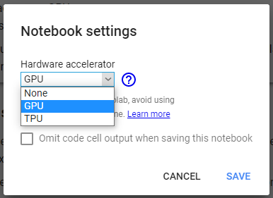

# Using the Inference Notebook with Google Colaboratory

​	Using the Notebook Inference on Google Colaboratory will ask you a bit more of configuration. Common requirements and configuration are provided in the [Using the Inference Notebook](Using-the-Inference-Notebook.md) page. 

## Index
1. [Specific requirements](#1-specific-requirements)
   * [Enabling GPU to accelerate the inference](#enabling-gpu-to-accelerate-the-inference)
   * [Getting the files easily without upload](#getting-the-files-easily-without-upload)
2. [Configuration of the notebook](#2-configuration-of-the-notebook)
   * ["Connecting to Google Drive" cell](#connecting-to-google-drive-cell)
   * ["Retrieving your image(s)" cell](#retrieving-your-images-cell)
   * ["By copy from Google Drive" cell](#by-copy-from-google-drive-cell)
   * ["Retrieving Weights File" cell](#retrieving-weights-file-cell)


## 1. Specific requirements
​	To run the notebook on Google Colaboratory, you will need a google account and uploading the required files somewhere in your Google Drive folder.

### Enabling GPU to accelerate the inference

For better performance, enable GPU under hardware accelerator: `Runtime` > `Change runtime type` or  `Edit` > `Notebook Settings` and then `'Hardware Accelerator' dropdown list` > `GPU`.





### Getting the files easily without upload
​	You can get the files directly in your Google Drive folder without having to upload it, you will need to know someone that can add you (with a Google Account, not an access link) to a Google Drive folder containing the wanted files and give you edit permissions. 

1. Once you have access to the folder, make a copy of the wanted file (for example, the weights file as it is quite heavy). _Be sure that the person has **paused** its syncing client if it has **Backup and Sync from Google** installed on a running computer_.

2. Right-click on the copy and move it to your personal Google Drive folder. _Once it is done, the other person can reactivate the syncing client if needed._

3. You can rename the file that is in your Google Drive and use it with the notebook from now on.

4. Repeat steps 1 to 3 for each file or folder you have to get.

## 2. Configuration of the notebook
​	A few variables have to be set in order to be able to run the notebook on Google Colaboratory. These are essentially paths to the needed files in Google Drive.

### "Connecting to Google Drive" cell
​	You can do this during the first execution, after completing all other configurations.  
​	The first time this cell runs, a link will be prompted to allow Google Colaboratory to access your Google Drive folders. Follow the link, choose the account containing the required files (at least the weights file) and accept. Then copy the given link to the input text field under the first link you followed.

### "Retrieving your image(s)" cell
​	In this cell, you just have to choose the way you want to import your image(s) (and annotations files). Use the dropdown list on the right to choose if you want to upload directly the file(s) or if you want to import it/them from a Google Drive folder.

### "By copy from Google Drive" cell
​	If you chose to get the file(s) from Google Drive, Be sure to customize the 2 variables for Google Colab to be able find your file(s) in Google Drive.
Let's say you have this hierarchy in your Google Drive:

```
Root directory of Google Drive
  ├─── Directory1
  └─── Directory2
       ├─── images
       │    ├─── example1.png
       │    └─── example2.png
       └─── saved_models
            ├─── mode1
            └─── mode2.zip
```

*   `execMode` should match the name of inference mode you will run with the images that will be retrieved;
*   `customPathInDrive` must represent all the directories between the root directory and your image file. In the example, it would be `Directory2/images/`. Keep it empty if **the file is directly in the root directory** of Google Drive;
*   `imageFilePath` must represent the file you want to upload. In the example, it would be `example1.png`. It can also be empty, if you want to import all the folder's images *(and annotations files if checkbox is checked)* directly to Google Colab, so in the example `example1.png` and `example2.png` would be imported;
*    `annotationsFile` if checked or set to True, the tool will retrieve annotations files (actually JSON and XML files) from the same folder. Value is `True` or `False`, you can also use the checkbox on the right on Google Colaboratory to do that.

Use the text fields available on the right or set directly the value.

```Python
[...]
execMode = 'chain' 
customPathInDrive = ""
imageFilePath = ""
annotationsFile = True
[...]
```

### "Retrieving Weights File" cell
​	Same thing than retrieving an image file using Google Drive but it is the saved weights file (folder or zip) for inference modes. With the past example, it would be `Directory2/saved_models/` as `customPathInDrive`.

- `execMode` should match the name of inference mode you will run with the images that will be retrieved;
- `customPathInDrive` must represent all the directories between the root directory and the weights file(s). In the example, it would be `Directory2/saved_models/`. Keep it empty if **the file(s) is directly in the root directory** of Google Drive;
- `isZipped` should be `True` if weights file(s) that will be retrieved are zipped (so they will be unzipped automatically), else it should be `False`. You can also use the checkbox on the right on Google Colaboratory to do that.

```Python
[...]
execMode = 'chain'
customPathInDrive = ""
isZipped = True
[...]
```
​	Following parameters are specific to the nephrology inference modes this Inference Tool was developed for. You may want modify this cell to adapt to your own inference modes. These parameters represent all the possible inference modes and their respective weights file name. The tool will try to retrieve folders/zip archives with the same name in your Google Drive.
```Python
[...]
cortex = "skinet_cortex_v2"
main = "skinet_main_v1"
mest_main = "skinet_mest_main_v3"
mest_glom = "skinet_mest_glom_v3"
inflammation = "skinet_inflammation_v3"
paths = {'cortex': cortex, 'main': main, 'mest_main': mest_main, 
         'mest_glom': mest_glom, 'inflammation': inflammation}
[...]
```

